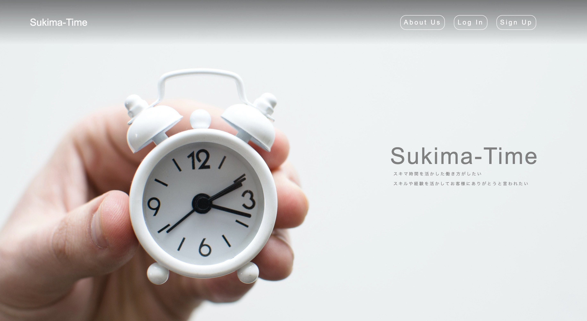

# アプリケーション名
スキマタイム

# このアプリで出来ること 
 スキマ時間を利用し、販売の仕事ができるアプリです。  
 ユーザーが空いている日、時間を投稿し、それを見たお店が仕事を依頼するサービスです。  
 
# 制作背景  
 前職で「あったらいいな」と思ったことをアプリにします。前職はアパレルメーカーで働いていました。  
 販売の現場では、時間帯によって人手が足りないという時間があり、その時間だけピンポイントで働くという働き方ができたらいいのになと感じていました。  
 そこで、その課題を解決すべく、このアプリを考えました。  
 ピークタイムなどに働いて欲しいお店と子育ての間などの"スキマ時間"を有効に活用したい方など、双方がwin-winになるアプリです。
 
# 概要
 ・データベース設計  	
 ・ユーザー新規登録・ログイン機能・マイページ  
 ・メッセージ投稿  
 ・メッセージ一覧表示  
 ・メッセージ削除  
 ・検索機能  
 ・コメント機能（非同期通信）  
    
# 開発環境  
 ・Ruby  
 ・Ruby on Rails  
 ・MySQL  
 ・Github  

# DB設計
## messagesテーブル
|Column|Type|Options|
|------|----|-------|
|name|string|null: false|
|title|string|null: false|
|year|integer|null: false|
|month|integer|null: false|
|day|integer|null: false|
|start|time|null: false|
|end|time|null: false|
|money|integer|null: false|
|text|string|null: false|
|user_id|integer|null: false, foreign_key: true|
|city_id|integer|null: false, foreign_key: true|
### Association
- belongs_to :users
- belongs_to :cities

## usersテーブル
|Column|Type|Options|
|------|----|-------|
|firstname|string|null: false|
|lastname|string|null: false|
|age|string|null: false|
|mail|string|null: false|
|password|string|null: false|
### Association
- has_many :images
- has_many :messages

## imagesテーブル
|Column|Type|Options|
|------|----|-------|
|images|string|null: false|
|user_id|integer|null: false, foreign_key: true|
### Association
- belongs_to :user

## citiesテーブル
|Column|Type|Options|
|------|----|-------|
|cities|string|null: false|
|user_id|integer|null: false, foreign_key: true|
### Association
- has_many :messages